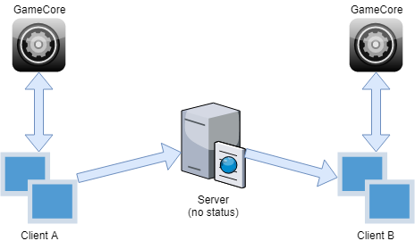
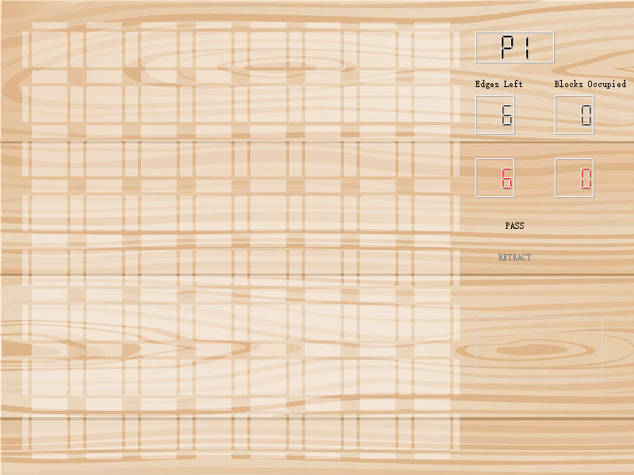
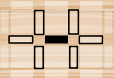
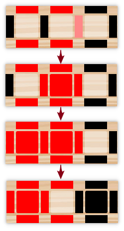

# edges-and-blocks

本项目为一款原创棋类游戏，基于C++/Qt实现，支持本地对战和网络对战两种方式。

## 项目简介

### 项目组成

 - GameCore：游戏核心逻辑，提供游戏操作的接口
 - ClientGUI：基于Qt实现的客户端操作界面
 - Server：简陋的游戏服务器，一局游戏结束后自动退出

### 开发环境

Windows 8.1 + Visual Studio 2017 + Qt 5.7.1

### 运行环境

Windows 8.1 / 10

### 运行方式

编译或解压后可以得到两个可执行文件：

 - **ClientGUI.exe**
 	
	客户端，游戏本体，提供本地对战（Local Game）和网络对战（Network Game）两种对战方式。在进行网络对战之前，需要在下方输入栏填写服务端IP地址与端口号。

	游戏中，玩家可以以此执行三种操作：落子（在棋盘上点击）、跳过行动（Pass）、悔棋（Retract）。

 - **Server.exe**

	临时服务端，运行后即等待客户端的连接，当连接数达到2时开启游戏。一轮游戏结束后服务端自动退出，若开启新游戏需要重新运行服务端。

### 网络架构

如上图，目前网络对战的设计较为简陋，服务端实际充当请求转发的作用，并没有对双方的操作进行合法性验证，因此是**不安全**的。

## 游戏规则

### 游戏概述

棋盘包括**64个格子**和**128条边**（64条横边+64条纵边），同一行列中位于棋盘两端的办边实为同一条边。

游戏开始时，所有的边、格均为空。

### 落子规则

双方玩家分为红黑两方，轮流落子于边上，黑方先行。

玩家有两种落子方式，即**直接落子**和**移动落子**。

- **直接落子**

	玩家直接在棋盘**任意空边**上放置一枚本方棋子，但是该落子方式**存在次数限制**（剩余可直接落子数量如棋盘右侧Edges Left所示）。

- **移动落子**

	玩家选择一枚本方棋子，将其移动至与其**相邻**的**空边**。以此法进行落子**无次数限制**。棋子可移动的范围入下图黑框所示：

	

### 格的占领和销毁

- **格的占领**

	当某一格的四周**皆为红边**或**皆为黑边**时，该格即被相应玩家占领，变为与边相同的颜色，记相应玩家**格数+1**。

- **格的销毁**

	当被某玩家占领的格周围**存在异色边**时，该格即被销毁，恢复为空格，记该玩家**格数-1**。

### 终局条件

当某次落子及其造成的影响全部判定结束时，若某名玩家格数达到**5**或以上，该玩家宣告**胜利**。

若棋盘上**已无空边**，且双方玩家仍未达到胜利条件，本局**平局**。

### 吃子

- **条件**

	当满足以下条件时，触发吃子：

 	- 某格周围的某条边**颜色发生了改变**（落子或被吃）
 	- 颜色改变后，该格周围存在**三条同色边**和**一条异色边**，且**无空边**
 	- 该异色边在本次落子后**未被任意一方吃掉过**

	此时，异色边会被吃掉，其颜色变为和同色边一致。

	需要注意的是，吃子必然伴随着格的占领，并且**吃子可以连锁进行**。

- **优先顺序**

	在某些特殊情况下，玩家的落子可能造成本方某边和对方某边同时被吃的局面，此时规定**先判定对方边被吃**所造成的全部变化，**再判定本方边被吃**所造成的变化。

### 边的补充

在“落子规则”一节中提到过，直接落子有次数限制（暂时将该次数称为“可直接落子数”）。初始每名玩家的“可直接落子数”为**6**，每次直接落子后，“可直接落子数”都会减少1，**减到0后玩家将只能移动落子**。

为防止由于吃子造成的本方边数量单调减少，游戏保证落子前后，各个玩家**持有边的数量**（棋盘上本方边数量 + 可直接落子数）**不减少**。**玩家在棋盘上失去的边，可以通过增加“可直接落子数”的方式补回；而在棋盘上增加的边，不会导致“可直接落子数”的减少。**

*例如上图中，红方落子后，吃子判定前，棋盘上有红边和黑边各5条；吃子判定后，棋盘上有红边6条，黑边4条。由于黑边数量减少了1，故黑方“可直接落子数”增加1，红方“可直接落子数”不变。*

## 版本内容更新

### v0.1919.810-alpha

 - 解决了缺少VC运行库的问题（其实就是把俩dll甩了上去，逃
 - 解决了若干bug：
	- 偶尔有部分edge无法回退
	- 网络对战时被回退的边，鼠标移动上去不会变色
 - 解决了由于系统放大比例的不同，导致字体显示不完全的问题（其实就是把字体大小卡死了，逃
 - 对部分使用场景进行了美化
 - 设置客户端程序图标

### v0.114.514-alpha

首次发布版本